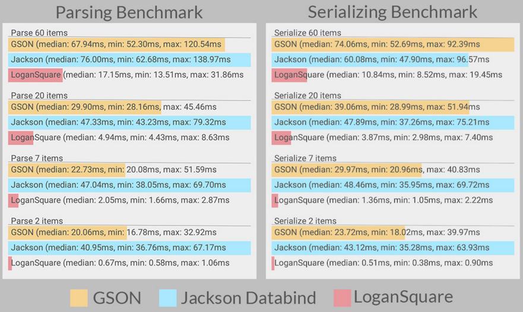

Retrofit2+RxJava+LoganSquare最佳实践
====================================
##基本介绍
Retrofit是Square的一个非常知名的开源的网络请求库，并且是由Android大神JakeWharton亲自操刀。

现在Retrofit已经出到2.0.2版本了，与前的1.9版本相差很大，并且官方强烈推荐2.0版本，所以在此就只聊2.0以后的版本。

##马上开撸！
首先肯定要在build.gradle中添加retrofit的依赖。

```
compile 'com.squareup.retrofit2:retrofit:2.0.2'
```

创建一个HTTP API的接口。

```
public interface ZhihuService {
   
	@GET("news/latest")
    Call<Daily> getLatest();
    
}
```
实例化ZhihuService，然后发起HTTP请求。

```
Retrofit retrofit = new Retrofit.Builder()
    .baseUrl("http://news-at.zhihu.com/api/4/")
    .build();
ZhihuService service = retrofit.create(ZhihuService.class);
```

```
Call<Daily> daily = service.getLatest();
```

##说好的RxJava呢？

RxJava到底是什么？

Reactive Extensions for the JVM – a library for composing asynchronous and event-based programs using observable sequences for the Java VM.


如果不熟悉RxJava的朋友，可以看看这篇文章，[给 Android 开发者的 RxJava 详解](http://gank.io/post/560e15be2dca930e00da1083#toc_1)

Retrofit2.0依然是支持RxJava的，但和以前的集成在一起不同，现在是完全独立的，需要自己添加CallAdapter。这样的好处是更灵活，更解耦。

```
/**
 * Add a call adapter factory for supporting service method return types other than {@link
 * Call}.
 */
public Builder addCallAdapterFactory(CallAdapter.Factory factory) {
      adapterFactories.add(checkNotNull(factory, "factory == null"));
    return this;
}

```

##添加RxJavaCallAdapter

```
compile 'com.squareup.retrofit2:adapter-rxjava:2.0.2'
```

```
Retrofit retrofit = new Retrofit.Builder()
                .baseUrl(HOST_NAME)
		        .addCallAdapterFactory(RxJavaCallAdapterFactory.create())
                .build();
```

##现在Retrofit可以使用RxJava了

**首先修改我们的API接口。**

```
public interface ZhihuService {
	
	 @GET("news/latest")
	 Observable<Daily> getLatest();
	     
}
```

**RxJava的使用在这里！！**

```	
    ZhihuService service = retrofit.create(ZhihuService.class);
    Observable<Daily> observable = service.getLatest();
    observable.subscribeOn(Schedulers.io())
            .observeOn(AndroidSchedulers.mainThread())
            .subscribe(new Observer<Daily>() {
        @Override
        public void onCompleted() {
        }

        @Override
        public void onError(Throwable e) {
        }

        @Override
        public void onNext(Daily daily) {
        }
    });

```

##Retrofit Converter的使用
Converter和CallAdapter一样，也从Retrofit中分离出来，需要自己添加。官方提供了很多convertes.

* gson
* jackson
* moshi
* protobuf
* scalars
* simplexml
* wire

但是发现没有LoganSqaure，那只有自己撸了，还好在github上已经有写好的，是时候发挥我们的拿来主义的精神了，不然怎么说我们都是github的搬运工呢。

```
complie 'com.github.aurae.retrofit2:converter-logansquare:1.4.0'
```

```
Retrofit retrofit = new Retrofit.Builder()
                .baseUrl(HOST_NAME)
                .addConverterFactory(LoganSquareConverterFactory.create())
                .addCallAdapterFactory(RxJavaCallAdapterFactory.create())
                .build();
```

##为什么使用LoganSquare来解析JSON？

天下武功唯快不破！因为LoganSquare快啊！


 Note: Our "400% or more" performance improvement metric was determined using ART. While LoganSquare still comes out on top with Dalvik, it seems as though the comparison is much closer. The benchmarks shown are actual screenshots taken from a 2nd gen Moto X.	

####添加LoganSquare
```
buildscript {
    repositories {
        jcenter()
    }
    dependencies {
        classpath 'com.neenbedankt.gradle.plugins:android-apt:1.8'
    }
}
apply plugin: 'com.neenbedankt.android-apt'

dependencies {
    apt 'com.bluelinelabs:logansquare-compiler:1.3.6'
    compile 'com.bluelinelabs:logansquare:1.3.6'
}
```

##打印Log
很多时候，我们希望打印Http请求的Log，这样方便调试。在老版本的Retrofit中，有个方法

```
new RestAdapter.Builder()
    .setLogLevel(RestAdapter.LogLevel.FULL);
```

但是，在Retrofit2.0后，不再提供该方法了，需要依赖okhttp中的HttpLoggingInterceptor。

```
compile 'com.squareup.okhttp3:logging-interceptor:3.0.1'
```

```
HttpLoggingInterceptor interceptor = new HttpLoggingInterceptor();
        interceptor.setLevel(HttpLoggingInterceptor.Level.HEADERS);
        OkHttpClient okHttpClient = new OkHttpClient.Builder()
                .addInterceptor(interceptor)
                .build();
```

```
Retrofit retrofit = new Retrofit.Builder()
                .baseUrl(HOST_NAME)
                .client(okHttpClient)
                .addConverterFactory(LoganSquareConverterFactory.create())
                .addCallAdapterFactory(RxJavaCallAdapterFactory.create())
                .build();
```

##看了这么多，源码呢？
源码当然要献上的，之前的一个开源的APP叫[IDaily](https://github.com/liuguangqiang/Idaily)，其中的HTTP请求就是采用的Retrofit2+RxJava+LoganSquare，敢兴趣的朋友，可以看一下。

##That's all!
到此就结束了, 初次类似的文章，如有错误，望见谅！谢谢！