ButterKnife源码分析
===========================
之前有朋友认为ButterKnife是通过反射来实现，虽然确实可以用反射来完成其功能，而且做法还相对要简单，但是这种方式的性能很低，特别是对类似Android这样的系统，对性能要求很苛刻的情况，最好不要用反射。

那我们一起看看ButterKnife是怎么工作的。

##从源码的角度走进ButterKnife

我们先从ButterKnife.bind()作为切入点

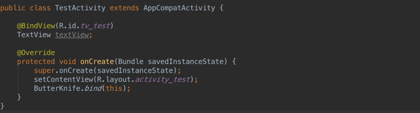

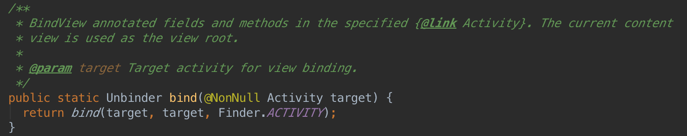

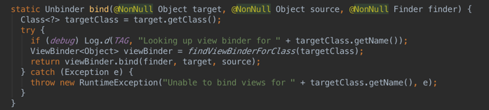

上面可以看到，在Actvity中调用ButterKnife.bind(this)，最终会使用findViewBinderForClass()来找到一个ViewBinder。

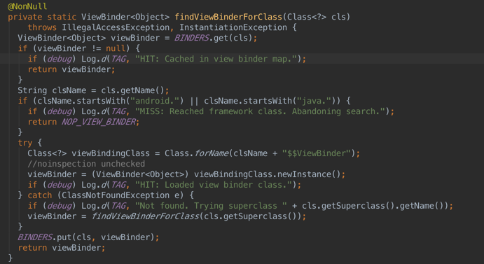

findViewBinderForClass找到的是以$$ViewBinder作为后缀的一个class，比如TestActivity$$ViewBinder.class , 那我们再看看ViewBinder是什么。

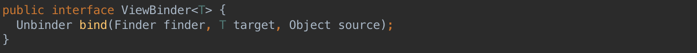

原来ViewBinder是一个接口，ButterKnife在编译时，自动生成的TestActivity$$ViewBinder.class已经实现这个接口，这里就是真正实现bind()的地方。

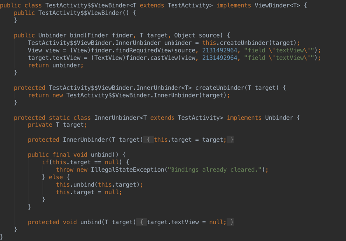

bind()会调用方法finder.findRequiredView()来初始化我们需要的View， 有没有觉得findViewById()很相似呢？我估计应该使用的就是这个方法。（ps：请忽略这句废话！）
我们看看是否如此。


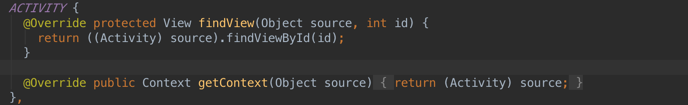

说白了，搞了这么多，依然是使用findViewById()来初始化一个View，不过不需要我们自己来写。
**只需要一个简单的注解，然后编译时自动生成需要的代码，这就是ButterKnife的核心。**

##那ButterKnife到底怎么通过注解来生成代码的呢？
####BindingClass + JavaPoet
需要自动生成代码的话，这里就不得不提到[javapoet](https://github.com/square/javapoet)了。javapoet是square开源的一个自动生成代码的库，介绍如下：
```
A Java API for generating .java source files.
```
而这里的BindingClass则是告诉javapoet需要生成什么样的代码，比如类名，包名等。

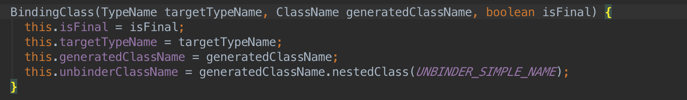
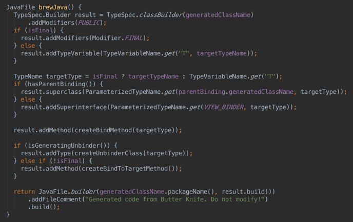

####ButterKnifeProcessor
ButterKnifeProcessor是一个继承自AbstractProcessor的类，它是ButterKnife的注解处理器，在编译时，会调用process()，并通过BindingClass + JavaPoet来生成代码。

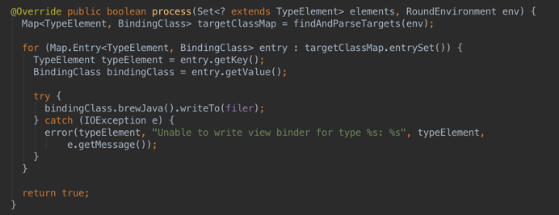

process中的代码很少，第一行代码会调用findAndParseTargets返回一个叫targetClassMap的Map对象，最后遍历整个Map，找到所有的BindingClass，然后生成代码。那我们看看findAndParseTargets到底怎么来得到这些BindingClass的. (ps :由于代码太长了，这里我们只看@BindView相关的部分代码。)

####findAndParseTargets + parseBindView + getOrCreateTargetClass

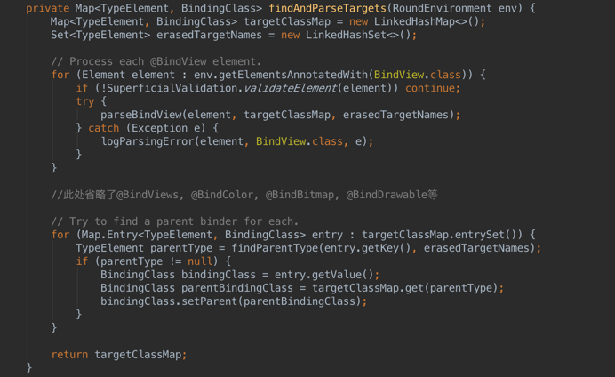
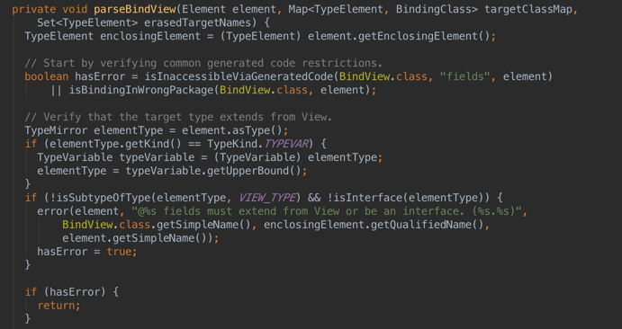
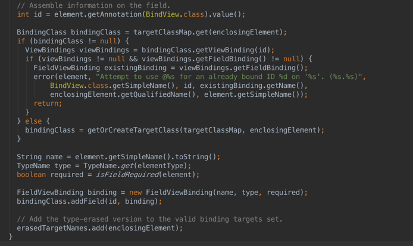
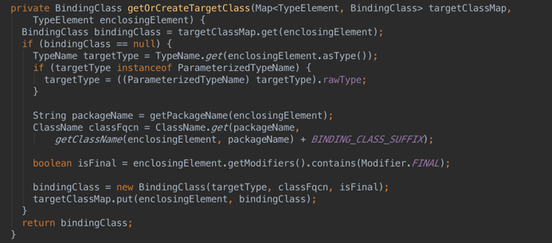

findAndParseTargets遍历所有使用了@BindView注解的Element，然后parseBindView先判断被注解的Element，是否是View的子类，如果不是，"抛出"异常 "xx fields must extend from View or be an interface."  如果是View的子类，则检查我们需要的BindingClass是否已经存在，如果不存在，则使用getOrCreateTargetClass新建一个，并放入targetClassMap这map中。

**这里的targetClassMap就是process中，需要遍历的Map，所有通过注解@BindView得到的BindingClass都在其中，这就是ButterKnifeProcessor需要生成什么代码的依据。**

####getSupportedAnnotationTypes
当然，要完成这个注解处理器，必须实现getSupportedAnnotationTypes这个方法，此方法就是告诉ButterKnifeProcessor到底支持那些自定义的注解。比如我们熟悉的@BindView, @BindViews, @BindColor等等。

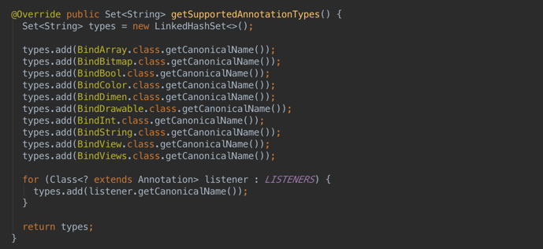

####最终生成的ViewBinder


##剧终
以上就是ButterKnife的实现了，分析的可能不是很到位，如有错误，希望得到指正，Thanks !