以Android项目为例了解Travis CI的使用
============================================

##什么是Travis CI？
Travis CI是目前最流行的持续集成构建工具，简洁清新独树一帜，目前github上的很多开源项目都在使用Travis CI作为持续集成构建环境。

##那些企业在使用Travis CI呢？
这么多大厂都在使用这个平台，我们还有什么理由不用呢？


##那到底怎么开始呢？
如果你已经有了github账号的话，就非常简单了，当然这里我假设你已经有github账号。

打开Travis CI的网站，一个大大的按钮如图所示，Sign in with Github!

[](https://travis-ci.org/)

登录成功，完成同步后，选择一个需要做持续集成的项目

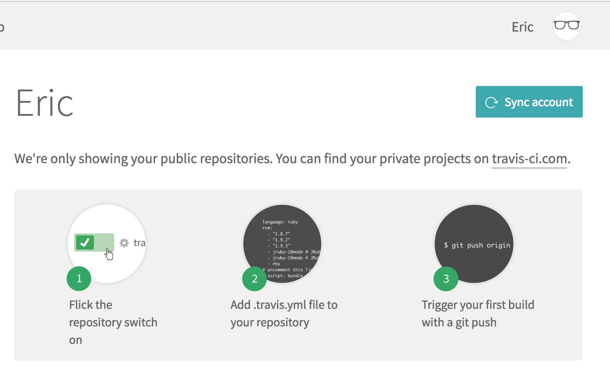
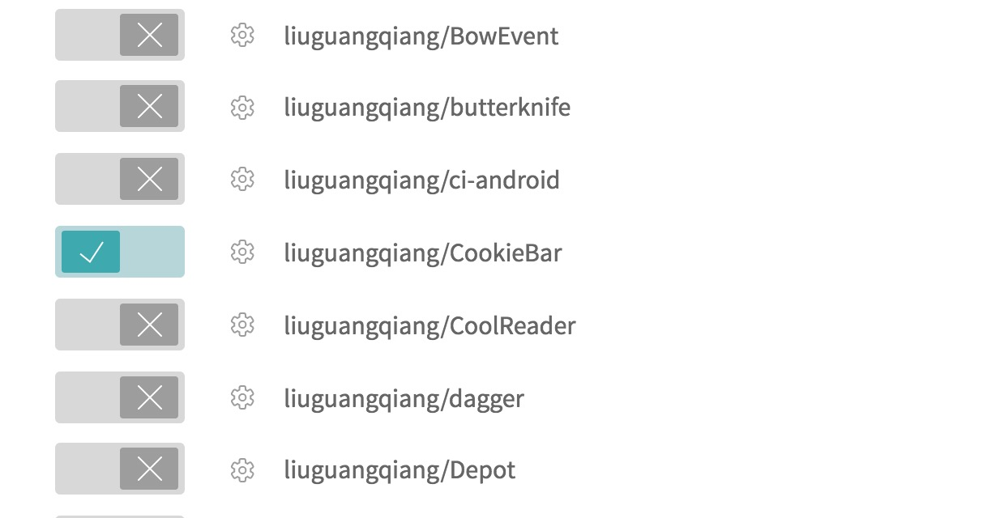

到这里，准备工作就做完了，是不是很方便！

##以CookieBar这个项目为例，看需要几步完成Travis CI的配置！

###第一步，创建.travis.xml配置文件
这个文件需要放到项目的根目录下。

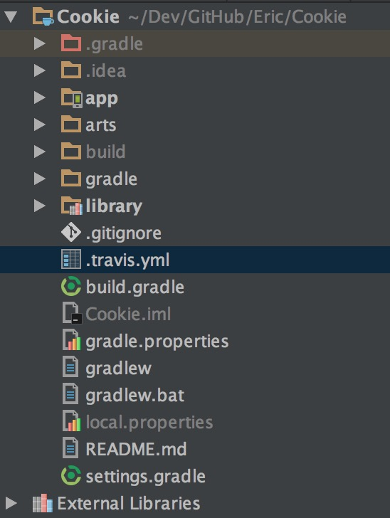

###第二步，简单的配置是必须的
首先是配置环境的环境
```
language: android
jdk: oraclejdk8
```

指定编译Android项目，需要使用到的组件和工具
```
android:
  components:
    # use the latest revision of Android SDK Tools
    - platform-tools
    - tools
    
    # The BuildTools version used by your project
    - build-tools-25.0.2
    
    # The SDK version used to compile your project
    - android-25
    
    # Additional components
    - extra-android-m2repository
```

最后加上需要执行的脚本，这里只需要build通过就可以了，如果还需要测试或者发布，就需要执行其他的脚本了。
```
script: ./gradlew build
```

OK！到此就配置完了，让我们再回顾一下完整的配置文件（靠！就只有TMD几行代码，还需要回顾？你逗我？）

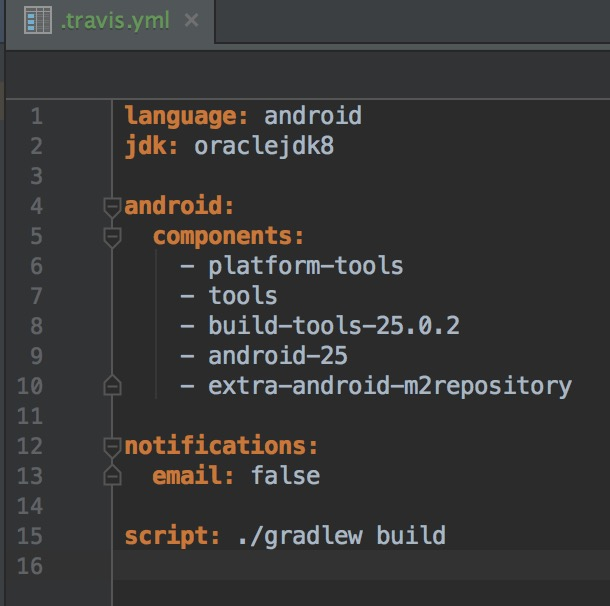


(为什么要回顾呢？这就不懂了吧，知识点！知识点！要凑字数啊！)

###第三步，不测试一下吗？
当然，不测试怎么行呢，随便写点commit，push到master分支就可以了，其他的都交给Travis CI自己玩儿！

push成功后，回到Travis CI，发现刚才的项目已经开始构建了，拼命的转菊花！
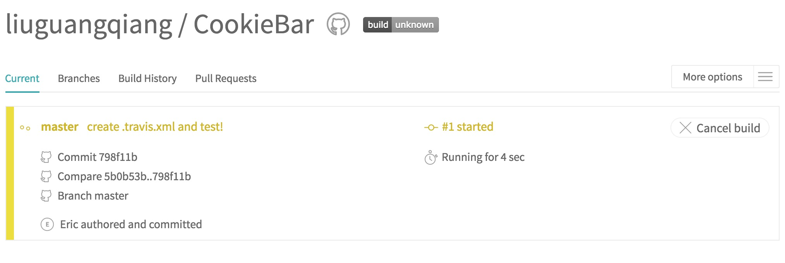
在无聊的等待过程中，我们能做什么呢？闭上眼睛，默默的祈祷，千万别失败！千万别失败！


靠！等了许久，终于构建成功了！（汗，还好没有整段垮掉！）
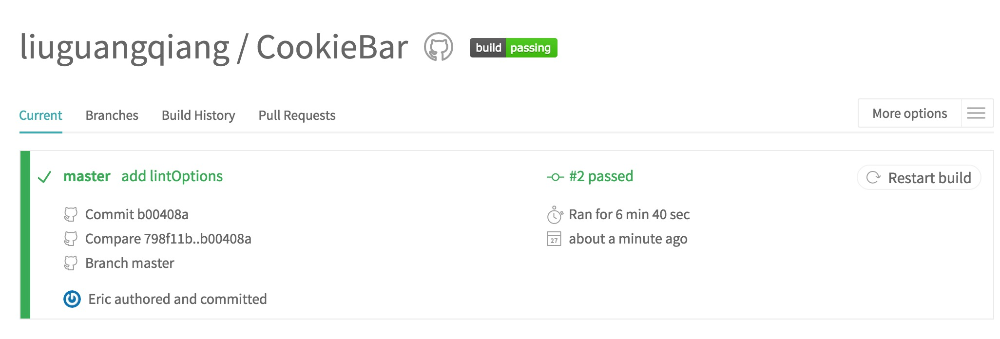

（细心的人，或许看出来了，第一次其实失败了，build.gradle中少了lintOptions {abortOnError false}，不过和今天的主题没有关系，就忽略吧，上面成功的截图，是第二次构建了）

##打包APK，发布到fir.im
先声明，我不是fir的推广人员哈，我只是经常是fir而已。

修改根目录中的build.gradle, 加上fir需要的依赖

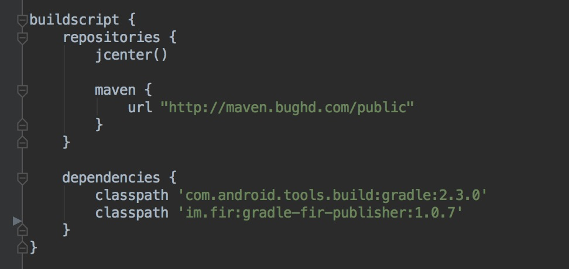

配置需要打包的项目中的build.gradle
引入插件
```
apply plugin:'im.fir.plugin.gradle'
```
配置fir
```
 fir{
        apiToken '填上fir上的apiToken'
        changeLog '更新日志'
    }
```
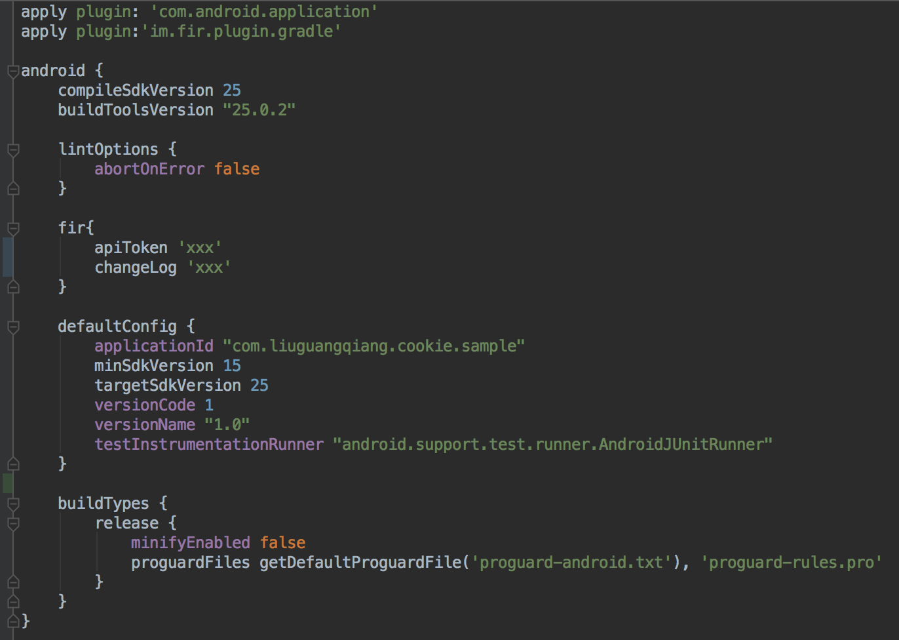

再修改.travis.xml中, 把gradlew build修改为publishApkRelease

```
script: ./gradlew publishApkRelease
```
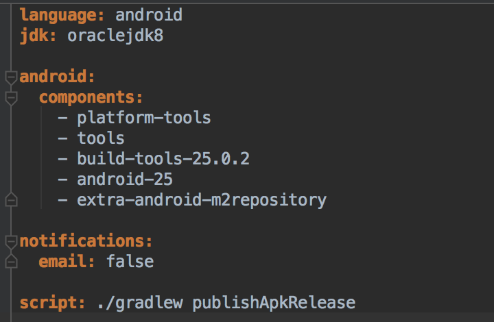

再次提交代码之后，就会自动打包并上传到Fir.im了

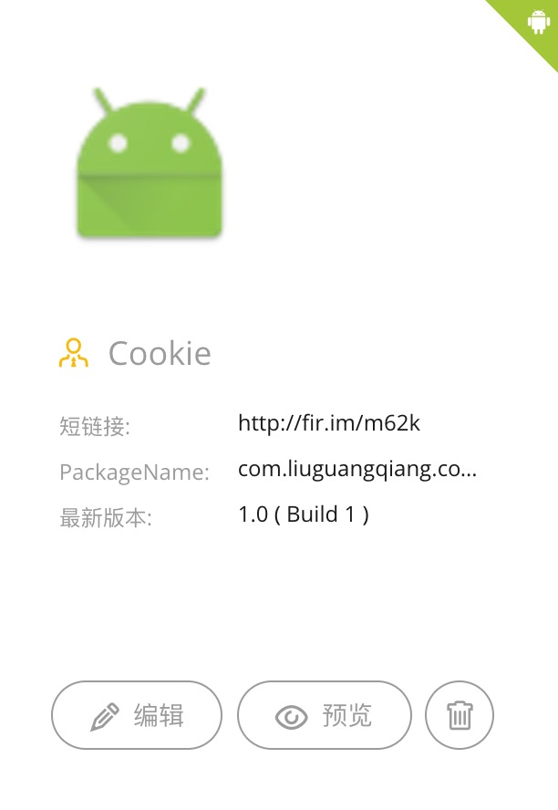

打包上传就算完了，但仅仅这样肯定不行了，因为我们的APK还没有签名，再配置好签名就OK了！

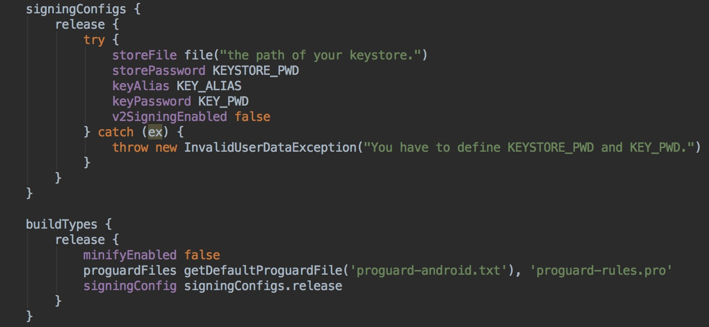
####到目前为止，就完成了自动打包且签名，然后再上传到fir.im的整个流程了！

##完结
使用Travis CI很简单，总共就几行配置文件而已，分分钟搞定，但要完成从构建，测试和发布，真正的实现持续集成构建，还需要更多的步骤，这里只是一个引子，让更多的人知道和了解Travis CI，但要想更好的利用Travis CI，就需要各位看官自己动手尝试。

##参考链接
  * [https://docs.travis-ci.com/user/getting-started](https://docs.travis-ci.com/user/getting-started)
  * [https://docs.travis-ci.com/user/languages/android/](https://docs.travis-ci.com/user/languages/android/)
  * [http://blog.fir.im/gradle/](http://blog.fir.im/gradle/)